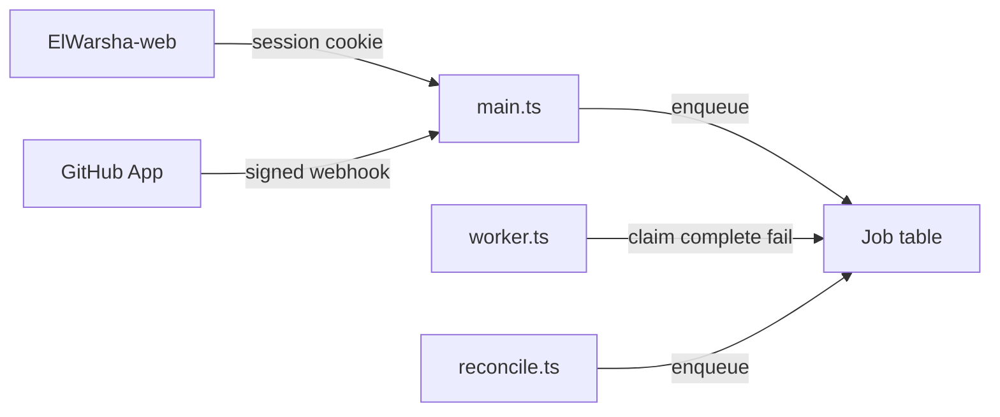

# ElWarsha API architecture

## System context

The API is a modular monolith with three process entry points:

| Process   | File               | Role                                             |
| --------- | ------------------ | ------------------------------------------------ |
| HTTP API  | `src/main.ts`      | Browser and webhook HTTP, OpenAPI at `/api/docs` |
| Worker    | `src/worker.ts`    | Claims PostgreSQL jobs every two seconds         |
| Reconcile | `src/reconcile.ts` | One-shot enqueue of `reconcile_pull_requests`    |

Auth0 proves identity. NestJS issues opaque sessions. PostgreSQL stores users,
memberships, products, cohorts, engagements, assignments, submissions, and
GitHub snapshots. A GitHub App posts signed webhooks; the worker processes them.

Default local identity is the fake adapter (`IDENTITY_PROVIDER=fake`).

## Processes and jobs

Webhook HTTP verifies the signature, persists the delivery, and enqueues
`process_github_webhook` in one transaction. Duplicate GitHub deliveries are
acknowledged without adding another job. The worker atomically claims a job
with `FOR UPDATE SKIP LOCKED`; abandoned processing leases can be reclaimed
after five minutes. It then calls `GithubService.processDelivery`. That method
currently marks the delivery processed; PR, review, and check snapshot sync is
not implemented yet.

## Dependency direction

Target:

`controllers → application services → repository interfaces → Prisma adapters`

Domain models live in `src/domain`. `@prisma/client` types stay in
`src/infrastructure`.

Current foundation shortcuts:

- Catalog is controller → `CatalogRepository` (no application service).
- Identity repositories and `GithubService` inject `PrismaService` from feature
  modules. New persistence should move behind infrastructure ports.
- `JobService` is the durable queue; it is the only job writer.

## Module layout

Nest modules in `src/app.module.ts`:

- `identity` — OIDC/fake adapter, sessions, capability resolution
- `catalog` — read-only products, engagements, assignments
- `github` — webhook verification, delivery persistence, job enqueue
- `health` — `healthz` and `readyz`
- `jobs` — PostgreSQL queue in `src/infrastructure/jobs`

Products, cohorts, engagements, and assignments are domain concepts inside
`catalog`, not separate Nest modules. Submissions exist in the schema only.
See [`MODULE_MAP.md`](MODULE_MAP.md).

Cross-module rule: no internals. Other modules may import only `AuthGuard` and
`RequireCapability` from `src/modules/identity/auth.guard.ts`.

## HTTP surface

| Method | Path                      | Notes                         |
| ------ | ------------------------- | ----------------------------- |
| GET    | `/api/v1/auth/login`      | Redirect to identity provider |
| GET    | `/api/v1/auth/callback`   | Sets HttpOnly session cookie  |
| GET    | `/api/v1/auth/me`         | Session required              |
| POST   | `/api/v1/auth/logout`     | Revokes session               |
| GET    | `/api/v1/products`        | `products.read`               |
| GET    | `/api/v1/engagements`     | `cohorts.read`                |
| GET    | `/api/v1/assignments`     | `assignments.read`            |
| POST   | `/api/v1/github/webhooks` | Signature required            |
| GET    | `/healthz`                | Liveness                      |
| GET    | `/readyz`                 | Database ping                 |

Errors: `{ error: { code, message, requestId } }`.

## Authorization

Membership roles are fixed: participant, mentor, maintainer, admin. Roles map
to capabilities in `src/domain/roles.ts`. Route guards use the same set. In
the foundation, all four roles share the same capability list.

## Contracts

- Database: `prisma/schema.prisma`
- TypeScript client `@elwarsha/api-client@0.1.0`: `packages/client/src/index.ts`
- Env: `.env.example` and `src/config/env.ts`

Production auth callbacks use `API_ORIGIN`; browser redirects and CORS use
`WEB_ORIGIN`.
